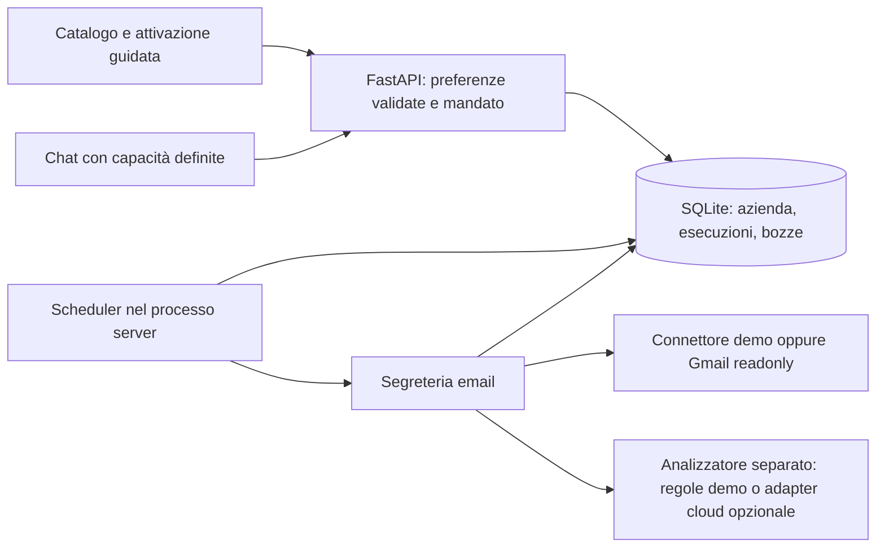

# Architettura e mandato del servizio

Il prodotto offre funzioni progettate dal gestore. La chat riconosce intenti supportati e indirizza all'attivazione: non costruisce workflow e non può attivare servizi, inviare messaggi o modificare autorizzazioni in risposta a una frase.

## Esecuzione

- L'attivazione salva un mandato esplicito: lettura e preparazione di bozze locali. Il backend rifiuta `send=true`; non esistono endpoint di invio né strumenti per farlo.
- Il worker server controlla gli orari anche con pagina e chat chiuse. Gli slot quotidiani e i risultati hanno vincoli di unicità nel database. Le esecuzioni manuali sono registrate separatamente; i tentativi ripetuti lavorano sullo stesso identificativo.
- I contatti e la configurazione aziendale sono validati. Il limite è quattro indirizzi distinti, un orario quotidiano e il fuso Europe/Rome oppure UTC. Le preferenze si possono cambiare senza riscrivere una richiesta in chat.
- Le bozze sono prima pendenti, poi possono essere segnate come riviste. Questa approvazione non comporta un invio o una scrittura esterna.
- Lo stato delle esecuzioni distingue attesa, esecuzione, attesa del nuovo tentativo, riuscita e fallimento. Gli errori riportano operazione, passaggio, risultato già completato e azione necessaria. I tentativi sono limitati a tre; una revoca dell'accesso non viene trattata come un guasto transitorio.

## Riavvio e fermo

L'installazione conserva file e dipendenze; il processo server deve essere riavviato. SQLite conserva la coda e le esecuzioni. Un lavoro interrotto può riprendere senza duplicare le bozze; il recupero degli slot scaduti è limitato, non garantisce attività durante lo spegnimento. Un servizio in pausa o disattivato non deve eseguire nuovo lavoro. Il processo usa un solo worker: scalare richiede un job runner esterno, lease transazionali distribuite e separazione del database.

Le chiamate HTTP al provider hanno timeout; l'esecuzione applica anche un budget temporale. Un errore di rete si riprova entro limiti. Un errore permanente o un'autorizzazione revocata richiede intervento. Una revisione delle credenziali cloud non avvia da sola un processo né prova l'accesso al provider.

## Dati e fornitori

Il database risiede sul server, nella cartella `.runtime` ignorata da Git. I token Gmail sono cifrati con Fernet e una chiave locale separata, non sono mai inviati al frontend. Il database delle email/bozze è protetto dai permessi di filesystem ma non è cifrato integralmente. Conservare la chiave accanto al database non protegge da un amministratore della stessa macchina: serve un secret manager per una distribuzione reale.

Gli input dei provider restano dati esterni. HTML e allegati non vengono eseguiti. Il modello non riceve tool né autorizzazioni di azione; il mandato viene applicato dalla logica applicativa. La validazione limita campi, contatti, orari e risultati riferiti ai messaggi letti. Il frontend inserisce il testo esterno come testo, non come HTML.

In assenza di un fornitore AI configurato il risultato usa regole deterministiche e template dichiarati. Non è una valutazione di qualità AI. L'adapter cloud opzionale serve a sperimentare soltanto sui dati dimostrativi; Gmail reale non invia contenuti al modello in questa versione. Prima di elaborare dati reali con un modello esterno servono condizioni contrattuali, trattamento dei dati, consenso operativo e verifica della qualità sul segmento scelto.

## Accesso

Questo MVP è per una sola azienda. L’avvio locale ascolta sull’interfaccia locale; Railway usa HTTPS e HTTP Basic con password server obbligatoria. Interfaccia, risorse statiche e API sono protette; solo GET /api/health espone uno stato tecnico minimo. Le mutazioni richiedono anche sessione e CSRF; il cookie è HttpOnly, SameSite e Secure su HTTPS. Il server controlla host e origine. Il log degli accessi è disabilitato per non registrare codici OAuth. L’accesso condiviso non introduce utenti separati o isolamento multiutente.

## Limiti prima del pilota reale

Account reali, consenso/verifica OAuth e qualità AI non sono collaudati. Mancano isolamento multiutente per azienda, account individuali, cifratura dell'intero archivio, cancellazione/retention automatica, backup operativi, monitoraggio centralizzato, billing e supervisione continua. Prima del pilota con email reali occorre completare questi passaggi e gli accordi di trattamento. Il pilota iniziale può usare dati sintetici o anonimizzati; nessun cliente deve confondere questo MVP con un servizio già disponibile in produzione.

## Riepilogo e agenda

Ogni controllo riuscito salva uno snapshot delle osservazioni originali, anche quando nessuna email produce una bozza. Le migrazioni di SQLite aggiungono i campi sorgente senza eliminare storico o revisioni. Il bootstrap ricava il briefing dai dati salvati senza contattare Gmail, non sostituisce risultati mancanti con esempi e indica periodo, copertura e data del controllo. Le assenze Gmail non sono verificabili perché il connettore limita le conversazioni lette. L’ultimo messaggio dei thread controllati include anche una risposta dello studio: questa evidenza elimina una vecchia priorità senza cancellare lo storico. Le priorità seguono urgenze esplicite e attesa, con motivi leggibili; non inferiscono scadenze.

L’agenda manuale salva gli orari in UTC e li presenta in Europe/Rome. Le rotte sono protette dai middleware di accesso e CSRF. L’esportazione è un file di testo per la giornata selezionata; non legge né modifica calendari esterni.

## Modalità reale e avvisi di risposta

`FILO_REAL_DATA_ONLY=1` presenta soltanto attività reali: profilo e contatti dimostrativi sono esclusi dalla vista, le rotte demo sono chiuse e il worker blocca controlli con casella o profilo dimostrativo. I record esistenti rimangono conservati. Gli slot quotidiani sono distinti per casella/revisione, così il passaggio a Gmail non viene bloccato dalle prove precedenti.

Gli avvisi persistono in `watch_requests`, vincolati alla casella e revisione Gmail corrente. La chat propone un contatto noto senza salvarlo o attivare mandati; la conferma usa la rotta protetta `/api/watches`. Il riscontro richiede un messaggio in ingresso dello stesso contatto, osservato dopo la creazione, arrivato nel giorno italiano richiesto e dopo la creazione. Nessun messaggio assente viene dato per verificato. Gli avvisi trovati precedono le priorità normali, poi si possono chiudere.

Un avviso odierno in attesa abilita controlli Gmail ogni cinque minuti, solo con servizio e mandato già attivi. Inflight, cooldown e slot con casella/revisione evitano controlli watch duplicati; un controllo quotidiano o manuale recente ritarda il successivo watch. Match, pausa, revoca e scadenza fermano il monitoraggio. I getter restano letture pure del database; la pagina si aggiorna ogni cinque secondi.
