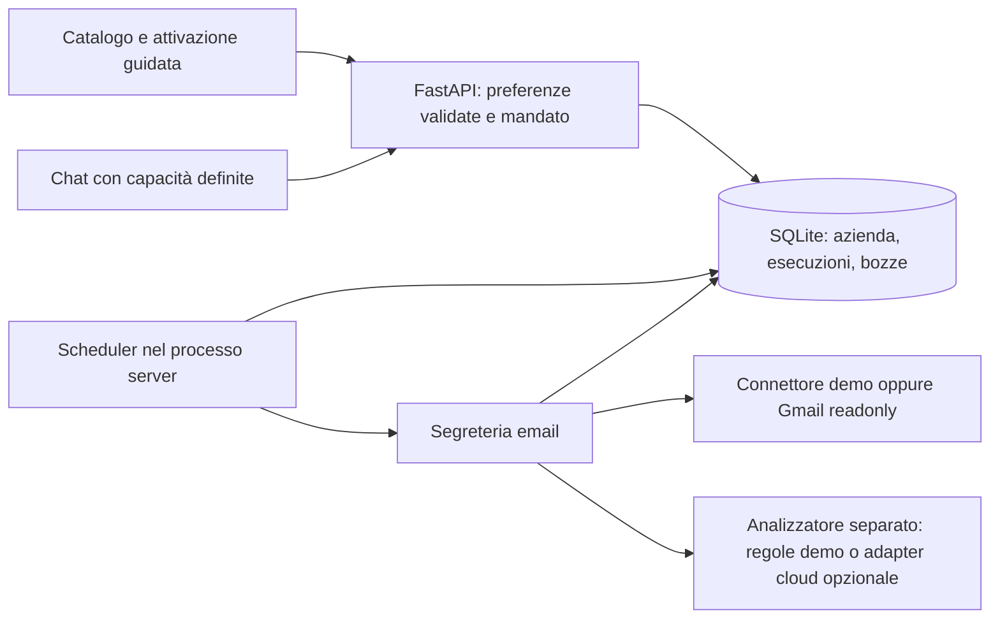

# Architettura e mandato del servizio

Il prodotto offre funzioni progettate dal gestore. La chat riconosce intenti supportati e indirizza all'attivazione: non costruisce workflow e non può attivare servizi, inviare messaggi o modificare autorizzazioni in risposta a una frase.

## Esecuzione

- L'attivazione salva un mandato esplicito: lettura e preparazione di bozze locali. Il backend rifiuta `send=true`; non esistono endpoint di invio né strumenti per farlo.
- Il worker server controlla gli orari anche con pagina e chat chiuse. Gli slot quotidiani e i risultati hanno vincoli di unicità nel database. Le esecuzioni manuali sono registrate separatamente; i tentativi ripetuti lavorano sullo stesso identificativo.
- I contatti e la configurazione aziendale sono validati. Il limite è quattro indirizzi distinti, un orario quotidiano e il fuso Europe/Rome oppure UTC. Le preferenze si possono cambiare senza riscrivere una richiesta in chat.
- Le bozze sono prima pendenti, poi possono essere segnate come riviste. Questa approvazione non comporta un invio o una scrittura esterna.
- Lo stato delle esecuzioni distingue attesa, esecuzione, attesa del nuovo tentativo, riuscita e fallimento. Gli errori riportano operazione, passaggio, risultato già completato e azione necessaria. I tentativi sono limitati a tre; una revoca dell'accesso non viene trattata come un guasto transitorio.

## Riavvio e fermo

L'installazione conserva file e dipendenze; il processo server deve essere riavviato. SQLite conserva la coda e le esecuzioni. Un lavoro interrotto può riprendere senza duplicare le bozze; il recupero degli slot scaduti è limitato, non garantisce attività durante lo spegnimento. Un servizio in pausa o disattivato non deve eseguire nuovo lavoro. Il processo usa un solo worker: scalare richiede un job runner esterno, lease transazionali distribuite e separazione del database.

Le chiamate HTTP al provider hanno timeout; l'esecuzione applica anche un budget temporale. Un errore di rete si riprova entro limiti. Un errore permanente o un'autorizzazione revocata richiede intervento. Una revisione delle credenziali cloud non avvia da sola un processo né prova l'accesso al provider.

## Dati e fornitori

Il database risiede sul server, nella cartella `.runtime` ignorata da Git. I token Gmail sono cifrati con Fernet e una chiave locale separata, non sono mai inviati al frontend. Il database delle email/bozze è protetto dai permessi di filesystem ma non è cifrato integralmente. Conservare la chiave accanto al database non protegge da un amministratore della stessa macchina: serve un secret manager per una distribuzione reale.

Gli input dei provider restano dati esterni. HTML e allegati non vengono eseguiti. Il modello non riceve tool né autorizzazioni di azione; il mandato viene applicato dalla logica applicativa. La validazione limita campi, contatti, orari e risultati riferiti ai messaggi letti. Il frontend inserisce il testo esterno come testo, non come HTML.

In assenza di un fornitore AI configurato il risultato usa regole deterministiche e template dichiarati. Non è una valutazione di qualità AI. L'adapter cloud opzionale serve a sperimentare soltanto sui dati dimostrativi; Gmail reale non invia contenuti al modello in questa versione. Prima di elaborare dati reali con un modello esterno servono condizioni contrattuali, trattamento dei dati, consenso operativo e verifica della qualità sul segmento scelto.

## Accesso

Questo MVP è per una sola azienda in una macchina privata. Le mutazioni richiedono sessione e token CSRF; la cookie è HttpOnly e SameSite. Il server controlla l'origine e ascolta solo sull'interfaccia locale. Il log degli accessi è disabilitato per non registrare codici OAuth nella query del callback. Queste misure non sostituiscono un login e non consentono una distribuzione pubblica.

## Limiti prima del pilota reale

Account reali, consenso/verifica OAuth e qualità AI non sono collaudati. Mancano isolamento per azienda, autenticazione, cifratura dell'intero archivio, cancellazione/retention automatica, backup operativi, monitoraggio centralizzato, billing e supervisione continua. Prima del pilota con email reali occorre completare questi passaggi e gli accordi di trattamento. Il pilota iniziale può usare dati sintetici o anonimizzati; nessun cliente deve confondere questo MVP con un servizio già disponibile in produzione.
