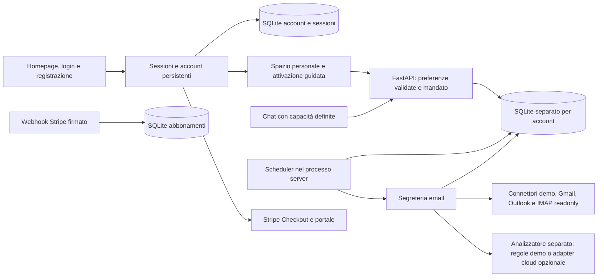

# Architettura e mandato del servizio Spazelia

Il prodotto offre funzioni progettate dal gestore. La chat riconosce intenti supportati e indirizza all'attivazione: non costruisce workflow e non può attivare servizi, inviare messaggi o modificare autorizzazioni in risposta a una frase.

## Identità pubblica e compatibilità

Il prodotto si presenta come Spazelia. Il rebranding conserva le variabili `FILO_*`, le sessioni e i cookie esistenti, i nomi dei database, gli identificatori delle rotte e il dominio Railway configurato. Non comporta una migrazione dei dati o una nuova autorizzazione delle caselle; eventuali modifiche al dominio richiedono una configurazione distinta di host, OAuth e ritorni Stripe. Gli snapshot di ricerca conservano i nomi e le citazioni originali; il report visualizza Spazelia nei soli testi editoriali riferiti al nostro prodotto.

## Esecuzione

- L'attivazione salva un mandato esplicito: lettura e preparazione di bozze locali. Il backend rifiuta `send=true`; non esistono endpoint di invio né strumenti per farlo.
- Il worker server controlla gli orari anche con pagina e chat chiuse. Gli slot quotidiani e i risultati hanno vincoli di unicità nel database. Le esecuzioni manuali sono registrate separatamente; i tentativi ripetuti lavorano sullo stesso identificativo.
- I contatti e la configurazione aziendale sono validati. Il limite è quattro indirizzi distinti, un orario quotidiano e il fuso Europe/Rome oppure UTC. Le preferenze si possono cambiare senza riscrivere una richiesta in chat.
- Le bozze sono prima pendenti, poi possono essere segnate come riviste. Questa approvazione non comporta un invio o una scrittura esterna.
- Lo stato delle esecuzioni distingue attesa, esecuzione, attesa del nuovo tentativo, riuscita e fallimento. Gli errori riportano operazione, passaggio, risultato già completato e azione necessaria. I controlli manuali e gli avvisi fanno al massimo tre tentativi; il controllo quotidiano, che ha un solo orario al giorno, riprova dopo 1, 5, 15, 30 e 60 minuti per coprire circa due ore di disservizio. Una revoca dell'accesso non viene trattata come un guasto transitorio. Ogni ora il worker elimina i controlli degli avvisi più vecchi di un giorno, senza bozze, i cui messaggi compaiono già in un controllo successivo: riepilogo, avvisi e suggerimenti leggono le stesse osservazioni.

## Riavvio e fermo

L'installazione conserva file e dipendenze; il processo server deve essere riavviato. SQLite conserva la coda e le esecuzioni. Un lavoro interrotto può riprendere senza duplicare le bozze; il recupero degli slot scaduti è limitato, non garantisce attività durante lo spegnimento. Un servizio in pausa o disattivato non deve eseguire nuovo lavoro. Il processo usa un solo worker: scalare richiede un job runner esterno, lease transazionali distribuite e separazione del database.

Le chiamate HTTP al provider hanno timeout; l'esecuzione applica anche un budget temporale. Un errore di rete si riprova entro limiti. Un errore permanente o un'autorizzazione revocata richiede intervento. Una revisione delle credenziali cloud non avvia da sola un processo né prova l'accesso al provider.

## Dati e fornitori

Gli archivi risiedono sul server, nella cartella `.runtime` ignorata da Git oppure nella cartella `ALEXCHIARA_DATA_DIR`. `accounts.sqlite3` conserva account, hash scrypt delle password, hash dei token di sessione e limiti dei tentativi; `billing.sqlite3` conserva identificativi Stripe e stato degli abbonamenti, senza dati delle carte. Lo spazio originale mantiene `alexchiara.sqlite3`; ogni nuovo account ha database e chiave delle credenziali separati in `workspaces/<id>/`.

I token Gmail/Outlook e le credenziali IMAP sono cifrati con Fernet e una chiave locale separata, non sono mai inviati al frontend. Il database delle email/bozze è protetto dai permessi di filesystem ma non è cifrato integralmente. Conservare la chiave accanto al database non protegge da un amministratore della stessa macchina: serve un secret manager per una distribuzione reale.

Gli input dei provider restano dati esterni. HTML e allegati non vengono eseguiti. Il modello non riceve tool né autorizzazioni di azione; il mandato viene applicato dalla logica applicativa. La validazione limita campi, contatti, orari e risultati riferiti ai messaggi letti. Il frontend inserisce il testo esterno come testo, non come HTML.

In assenza di un fornitore AI configurato il risultato usa regole deterministiche e template dichiarati. Non è una valutazione di qualità AI. L'adapter cloud opzionale serve a sperimentare soltanto sui dati dimostrativi; La posta reale non invia contenuti al modello in questa versione. Prima di elaborare dati reali con un modello esterno servono condizioni contrattuali, trattamento dei dati, consenso operativo e verifica della qualità sul segmento scelto.

## Accesso

`create_app` serve homepage, login, registrazione e risorse statiche pubblici. `/app`, `/account` e le API dei dati richiedono una sessione autenticata; le richieste API anonime ricevono 401 senza `WWW-Authenticate`, quindi non aprono il popup HTTP Basic del browser. GET `/api/health` espone soltanto lo stato tecnico. L’avvio locale ascolta sull’interfaccia locale e Railway usa HTTPS.

I link di recupero password sono token casuali di 256 bit salvati solo come hash SHA-256, monouso e validi 60 minuti; il reset e il cambio password chiudono le altre sessioni. L’eliminazione di un account cancella cliente Stripe, righe di fatturazione, utente (con sessioni e link a cascata) e cartella dello spazio, rinominata prima atomicamente e rimossa anche al riavvio successivo se l’operazione si interrompe. Le sessioni persistenti scadono dopo sette giorni, usano cookie HttpOnly, SameSite=Lax e Secure su HTTPS e vengono revocate all'uscita. Login e registrazione ruotano sessione e CSRF; le mutazioni, incluse quelle di autenticazione, richiedono CSRF valido e origine consentita. Il server controlla gli host e limita dimensione delle richieste e tentativi di accesso. Gli errori di validazione dell'autenticazione non ripetono la password inviata. Il log degli accessi è disabilitato per non registrare codici OAuth.

La sessione sceglie lo spazio sul server tramite l'identificativo dell'account, senza fidarsi di un identificativo fornito dal browser. `create_workspace_app` è la fabbrica interna dei servizi per un singolo archivio: i test di dominio la usano direttamente; l'avvio pubblico deve usare `create_app`. Ogni spazio mantiene DB, credenziali email e scheduler separati. Un lock protegge la creazione concorrente degli spazi; il processo riavvia i loro controlli autorizzati e li ferma alla chiusura.

Le credenziali `FILO_ACCESS_USERNAME` e `FILO_ACCESS_PASSWORD` accedono mediante il modulo all'account `owner`, che conserva l'archivio originale. Le registrazioni ricevono uno spazio vuoto distinto, senza dati fittizi o accesso allo spazio esistente. Non sono disponibili condivisione fra colleghi, inviti o gestione di ruoli aziendali.

## Abbonamento

L'integrazione prepara Stripe Checkout e il portale di gestione dell'abbonamento. Prezzo e chiavi sono scelti dal gestore sul server; il browser non può scegliere importo, cliente o account da addebitare. Lo stato degli abbonamenti viene aggiornato solo dai webhook firmati, con controllo della finestra temporale, degli identificativi e degli eventi duplicati. La pagina di ritorno dal checkout non prova il pagamento.

Senza configurazione Stripe completa il checkout è disabilitato e la registrazione non effettua addebiti. Il prezzo è ancora da definire e nessun collegamento o pagamento reale Stripe è stato collaudato. Lo stato è presentato nell'area personale: questa versione non applica restrizioni alle funzioni in base al piano. I dettagli di configurazione sono in [BILLING.md](BILLING.md).

## Limiti prima del pilota reale

Il collegamento a un account Google reale, il consenso/verifica OAuth, la qualità AI e i pagamenti reali Stripe non sono collaudati. Mancano recupero password e verifica email, cifratura dell'intero archivio, cancellazione/retention automatica, backup operativi, monitoraggio centralizzato e condivisione fra colleghi. Prima del pilota continuativo con email reali occorre completare i controlli operativi e gli accordi di trattamento. L'isolamento dei dati per account e i flussi di pagamento sono verificabili con test locali, che non dimostrano l'operatività dei fornitori esterni.

## Riepilogo e agenda

Ogni controllo riuscito salva uno snapshot delle osservazioni originali, anche quando nessuna email produce una bozza. Le migrazioni di SQLite aggiungono i campi sorgente senza eliminare storico o revisioni. Il bootstrap ricava il briefing dai dati salvati senza contattare Gmail, non sostituisce risultati mancanti con esempi e indica periodo, copertura e data del controllo. Le assenze Gmail non sono verificabili perché il connettore limita le conversazioni lette. L’ultimo messaggio dei thread controllati include anche una risposta dello studio: questa evidenza elimina una vecchia priorità senza cancellare lo storico. Le priorità seguono urgenze esplicite e attesa, con motivi leggibili; non inferiscono scadenze.

L’agenda manuale salva gli orari in UTC e li presenta in Europe/Rome. Le rotte sono protette dai middleware di accesso e CSRF. L’esportazione è un file di testo per la giornata selezionata; non legge né modifica calendari esterni.

## Modalità reale e avvisi di risposta

`FILO_REAL_DATA_ONLY=1` presenta soltanto attività reali: profilo e contatti dimostrativi sono esclusi dalla vista, le rotte demo sono chiuse e il worker blocca controlli con casella o profilo dimostrativo. I record esistenti rimangono conservati. Gli slot quotidiani sono distinti per casella/revisione, così il passaggio a Gmail non viene bloccato dalle prove precedenti.

Gli avvisi persistono in `watch_requests`, vincolati alla casella e revisione Gmail corrente. La chat propone un contatto noto senza salvarlo o attivare mandati; la conferma usa la rotta protetta `/api/watches`. Il riscontro richiede un messaggio in ingresso dello stesso contatto, osservato dopo la creazione, arrivato nel giorno italiano richiesto e dopo la creazione. Nessun messaggio assente viene dato per verificato. Gli avvisi trovati precedono le priorità normali, poi si possono chiudere.

Un avviso odierno in attesa abilita controlli della posta collegata ogni cinque minuti, solo con servizio e mandato già attivi. Inflight, cooldown e slot con casella/revisione evitano controlli watch duplicati; un controllo quotidiano o manuale recente ritarda il successivo watch. Match, pausa, revoca e scadenza fermano il monitoraggio. I getter restano letture pure del database; la pagina si aggiorna ogni cinque secondi.

## Provider email

`app/mail_providers.py` espone il catalogo e lo scollegamento locale. `app/outlook.py` gestisce PKCE e Microsoft Graph con permessi delegati Mail.Read/User.Read e offline_access. `app/imap_mail.py` verifica TLS993, rifiuta indirizzi privati e fissa la connessione all’indirizzo DNS verificato, mantenendo SNI e verifica del certificato per il nome originale. Le letture usano EXAMINE e BODY.PEEK, con limiti prima di allocare i literal. Gli allegati dei messaggi MIME limitati vengono esclusi dall’analisi.

Per compatibilità la revisione globale della casella si conserva nel campo `gmail_revision` e la chiave Fernet nel file `gmail.key`. Un cambio riuscito cancella gli accessi precedenti, invalida i consensi pendenti e il mandato, e ferma le esecuzioni in coda. Lo scope degli snapshot comprende provider, revisione e indirizzo. Aggiornamento del risultato e ultimo controllo avvengono nella stessa transazione, evitando di ripristinare un mandato rimosso. Anteprime e controlli scartano il risultato se la connessione cambia durante la lettura.

## Moduli aziendali PMI

`app/business_catalog.py` definisce 23 servizi locali, email/agenda e otto integrazioni non attive. `app/business.py` conserva `business_records` nel DB del singolo spazio e genera documenti testuali dai campi tipizzati. Denaro e IVA usano Decimal; gli input non possono cambiare servizio o spazio di un record. Le API offrono ricerca per servizio/stato e paginazione, lettura, creazione, modifica, cancellazione ed export protetto. Il riepilogo legge uno snapshot coerente, ordina le attività nel giorno italiano e prepara soltanto i documenti dei prossimi passi.

`app/business_chat.py` instrada richieste esplicite verso moduli locali, senza eseguire attività o ampliare il mandato email. Gli invii SDI/PEC, bonifici, pubblicità e altri collegamenti esterni restano indisponibili. I moduli persone registrano richieste e formazione senza valutazioni automatiche del personale. Tempi prima/dopo e minuti dichiarati rimangono fonti dell’utente, senza risparmi o ritorni economici inventati.

## Riuso del profilo e flussi commerciali

`app/company.py` normalizza i dati aziendali facoltativi e restituisce l'identità corrente dello spazio, escludendo quella dimostrativa. Il profilo resta in `kv`: non richiede una nuova tabella. Le richieste dei client precedenti conservano i nuovi campi omessi; una stringa vuota li cancella. Preventivi, bozze fattura e incassi leggono il profilo corrente quando generano il documento, senza presentarlo come una fattura storica immutabile.

`business_links` conserva l'origine e la destinazione di una conversione, con chiave unica per origine/servizio di destinazione e riferimenti con cancellazione a cascata. Una transazione `BEGIN IMMEDIATE` impedisce duplicati da richieste concorrenti. L'anteprima non scrive; il salvataggio copia i dati da rivedere, usa Decimal per l'importo dell'incasso e lascia invariati stato e dati dell'origine. La cancellazione dell'origine rimuove il collegamento, conservando la scheda di destinazione. I documenti non vengono emessi, inviati o pagati.

La ricerca trasversale usa parametri SQL e tratta `%`, `_` e backslash come testo. Cerca titolo, referente, note e valori dei dettagli attraverso `json_each`, evitando di cercare i nomi interni dei campi. La ricerca e le conversioni usano lo stesso database scelto dalla sessione delle altre rotte aziendali.

## Passaggi operativi, date e ripetizioni

`app/business_playbooks.py` definisce 94 passaggi manuali nei 23 moduli e i dieci campi data utilizzabili come scadenza operativa. La validazione confronta la copertura e i tipi con il catalogo. La colonna `business_records.steps` è aggiunta conservando i record precedenti: accetta soltanto booleani e identificatori previsti dal modulo. PATCH unisce i passaggi senza perdere gli altri. Il prossimo passaggio non segnato orienta le attività aperte; una scorta sotto soglia mantiene la priorità del controllo di riordino. Lo stato completato non implica la verifica dei passaggi.

`effective_due_date` usa prima la scadenza esplicita, poi il campo operativo compilato dall’utente; `due_source` ne rende leggibile l’origine. Riepilogo, ordinamento e conteggi del catalogo usano la stessa proiezione SQL, senza generare tutti i documenti. La data storica delle note spese è esclusa. `financial_summary` somma in Decimal soltanto importi aperti di incassi e spese, separando scaduti e oggi; non deduce saldi bancari né riconta preventivi e fatture. `stock_reorder` propone la differenza positiva tra soglia e quantità inserita, senza movimenti di magazzino.

GET `/api/business/records/{id}/repetition?next_date=...` prepara una proposta senza scrivere. POST `/api/business/records/{id}/repeat` salva la scheda revisionata, con data futura nel fuso italiano, stato da fare, minuti zero e passaggi vuoti. Le date precedenti vengono eliminate e il primo campo operativo riceve la nuova data; gli altri campi obbligatori restano da rivedere. La tabella `business_repeats` e una transazione `BEGIN IMMEDIATE` garantiscono una destinazione per origine e data, senza sovrascriverla quando la richiesta è ripetuta. Eliminare una scheda rimuove i collegamenti e conserva le altre schede. Sessione, CSRF e origine applicano gli stessi confini delle conversioni; non sono previsti scheduler di ricorrenze o azioni esterne.
